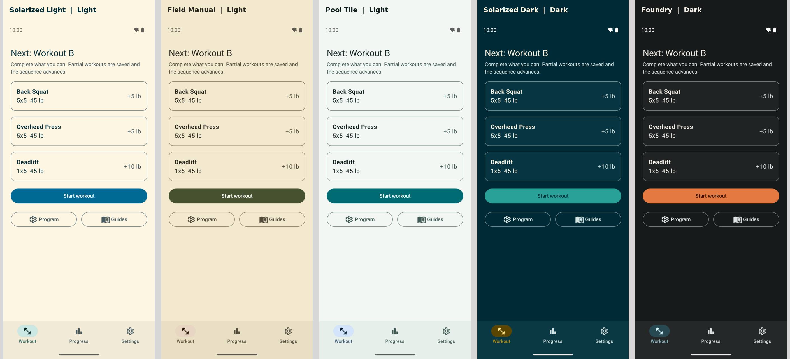

# FreeLift5

FreeLift5 is a private-by-design, offline Android tracker for the classic 5x5
barbell routine.

The implementation and data-flow overview is in
[docs/ARCHITECTURE.md](docs/ARCHITECTURE.md). Engineering guardrails carried
forward from completed work are in [docs/LESSONS.md](docs/LESSONS.md).

## Privacy

- No account
- No telemetry
- No advertisements
- No network permission
- No automatic Android backup
- User-controlled CSV and ZIP export

The manifest intentionally omits `INTERNET`, exact-alarm, account, health-sensor,
and analytics permissions.

## Features

- Multiple built-in programs — Original 5x5, Lite, Mini, Plus, and a dumbbell
  Quarantine routine — chosen at setup and switchable later without losing history
- Independent per-lift progression, three-failure deload suggestions, and
  partial-workout handling
- Optional e1RM-based starting weights or empty-bar starts
- Persistent active workouts and rest timers
- Core adaptations and weighted, bodyweight, repetition, or timed accessories
- Warmups, standard-plate loading, exercise guides, history, charts, and PRs
- Optional on-device reminders
- Versioned CSV and ZIP exports
- Five accessible color themes with system-following or fixed appearance

## Themes

FreeLift5 ships with Solarized Light and Dark, Field Manual, Pool Tile, and
Foundry. Choose separate day and night themes or keep one theme regardless of
the device appearance setting.

[View individual theme and promotional images](docs/THEMES.md).



## Development

Requirements:

- Android Studio with JDK 21
- Android SDK Platform 36
- Android SDK Build Tools 36.1
- An API 36 emulator or Android 9+ device

From the repository root:

```bash
./gradlew testDebugUnitTest lintDebug assembleDebug
./gradlew connectedDebugAndroidTest
```

The debug APK is written to:

```text
app/build/outputs/apk/debug/app-debug.apk
```

The debug APK is signed with Android's development key and can be sideloaded for
testing. Production release signing and tagged GitHub Releases are documented in
[docs/RELEASING.md](docs/RELEASING.md).

## Verification

The implementation is covered by 32 local unit tests and 13 instrumented tests.
The instrumented test matrix targets:

- Android 9 / API 28
- Android 16 / API 36

Run either matrix entry with `./scripts/test-avd.sh <avd-name>`.

Device coverage includes Room migration, routine and accessory progression,
partial-workout recovery, onboarding and navigation, active-session persistence,
timer persistence through activity recreation and backgrounding, and a
foreground timer with the screen off while notification permission is denied.

## License

FreeLift5 is licensed under GPL-3.0-or-later. See [LICENSE](LICENSE).
