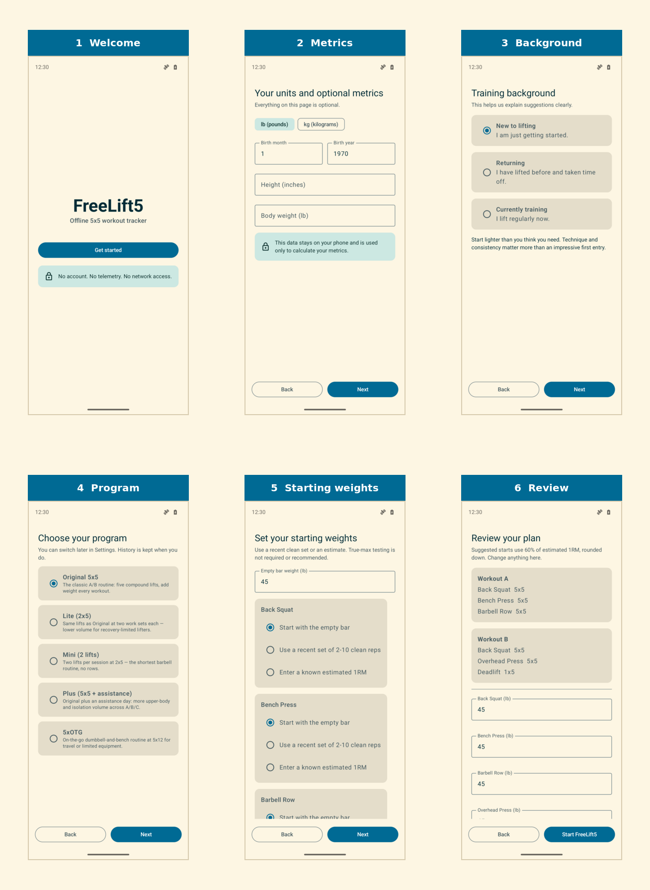
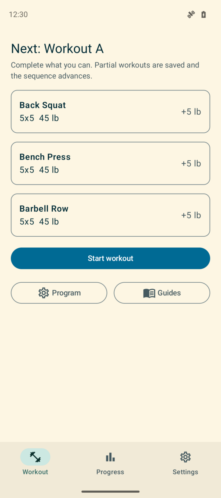

# FreeLift5

FreeLift5 is an offline Android tracker for the classic 5x5 barbell routine.

[Direct APK download for Android 9+](https://github.com/b3p3k0/FreeLift5/releases/download/v0.1.1/FreeLift5-v0.1.1.apk)

The 5x5 approach comes from the old-timey tradition of short, full-body
training that requires minimal equipment, built around compound lifts and steady progression. Its exact origin is lost to history, but its simplicity and results have made it a lsting staple in fitness. FreeLift5 follows that lineage: simple workouts, stable progress, and enough structure to keep training moving while preseving  your data sovreignity.

## Privacy

- No account
- No telemetry
- No advertisements
- No network permission
- No automatic Android backup
- User-controlled CSV and ZIP export

The manifest intentionally omits `INTERNET`, exact-alarm, account, health-sensor,
and analytics permissions.

## Features

- Multiple built-in programs — Original 5x5, Lite, Mini, Plus, and 5xOTG —
  chosen at setup and switchable later without losing history
- Independent per-lift progression, three-failure deload suggestions, and
  partial-workout handling
- Optional e1RM-based starting weights or empty-bar starts
- Persistent active workouts and rest timers
- Core adaptations and weighted, bodyweight, repetition, or timed accessories
- Barbell warmups, standard-plate loading, exercise guides, history, charts, and PRs
- Optional on-device reminders
- Versioned CSV and ZIP exports
- Five accessible color themes with system-following or fixed appearance

## Getting Started

Download the APK above, open it on your Android phone, and approve the install
when Android asks. You are not downloading FreeLift5 through an app store, so
your phone may ask you to allow installs from your browser or file manager before
it shows the normal install button.

After install, FreeLift5 walks you through optional units, body metrics, training
background, and starting weights. You can skip what you do not know and edit it
later.

Start your first workout from the Workout tab, check off sets as you lift, use
the built-in rest timer if you want it, and review the next weights before you
finish.

## Development

[For developers](docs/DEVELOPMENT.md)

## Disclaimer

FreeLift5 is a workout tracker, not medical advice or a professional training service. Use your best judgment, start conservatively, and consult a qualified health care professional before beginning or changing an exercise program, especially if you have been inactive, have an injury, have a medical condition, or have symptoms or concerns.

## License

FreeLift5 is licensed under GPL-3.0-or-later. See [LICENSE](LICENSE).
